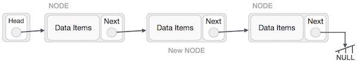
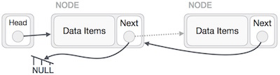

# 1. LinkedList (Introduction)

## 1. Overview

A linked list is a sequence of data structures, which are connected together via links.

Linked List is a sequence of links which contains items. Each link contains a connection to another link. Linked list is the second most-used data structure after array. Following are the important terms to understand the concept of Linked List:

- **Link** − Each link of a linked list can store a data called an element.

- **Next** − Each link of a linked list contains a link to the next link called Next.

- **LinkedList** − A Linked List contains the connection link to the first link called First.

## 2. Linked List Representation

Linked list can be visualized as a chain of nodes, where every node points to the next node.


As per the above illustration, following are the important points to be considered.

- Linked List contains a link element called first.

- Each link carries a data field(s) and a link field called next.

- Each link is linked with its next link using its next link.

- Last link carries a link as null to mark the end of the list.

## 3. Types of Linked List

Following are the various types of linked list:

- **Simple Linked List** − Item navigation is forward only.

- **Doubly Linked List** − Items can be navigated forward and backward.

- **Circular Linked List** − Last item contains link of the first element as next and the first element has a link to the last element as previous.

## 4 Basic Operations

Following are the basic operations supported by a list:

- **Insertion** − Adds an element at the beginning of the list.

- **Deletion** − Deletes an element at the beginning of the list.

- **Display** − Displays the complete list.

- **Search** − Searches an element using the given key.

- **Delete** − Deletes an element using the given key.

### 4.1. Insertion Operation

Adding a new node in linked list is a more than one step activity. We shall learn this with diagrams here. First, create a node using the same structure and find the location where it has to be inserted:


Imagine that we are inserting a node B (NewNode), between A (LeftNode) and C (RightNode). Then point B.next to C −

`NewNode.next −> RightNode`;

It should look like this −


Now, the next node at the left should point to the new node.

`LeftNode.next −> NewNode;`


This will put the new node in the middle of the two. The new list should look like this −



Similar steps should be taken if the node is being inserted at the beginning of the list. While inserting it at the end, the second last node of the list should point to the new node and the new node will point to NULL.

### 4.2. Deletion Operation

Deletion is also a more than one step process. We shall learn with pictorial representation. First, locate the target node to be removed, by using searching algorithms.


The left (previous) node of the target node now should point to the next node of the target node −

`LeftNode.next −> TargetNode.next;`


This will remove the link that was pointing to the target node. Now, using the following code, we will remove what the target node is pointing at.

`TargetNode.next −> NULL;`


We need to use the deleted node. We can keep that in memory otherwise we can simply deallocate memory and wipe off the target node completely.


### 4.3. Reverse Operation

This operation is a thorough one. We need to make the last node to be pointed by the head node and reverse the whole linked list.


First, we traverse to the end of the list. It should be pointing to NULL. Now, we shall make it point to its previous node −


We have to make sure that the last node is not the last node. So we'll have some temp node, which looks like the head node pointing to the last node. Now, we shall make all left side nodes point to their previous nodes one by one.



Except the node (first node) pointed by the head node, all nodes should point to their predecessor, making them their new successor. The first node will point to NULL.


We'll make the head node point to the new first node by using the temp node.


# 2. LinkedList (Implementation)

```java
public class LinkedList {
	Node head;

	class Node {
		int data;
		Node next;
	}

	public void insert(int data) {
		Node node = new Node();

		node.data = data;
		node.next = null;

		if (head == null) {
			head = node;
		} else {
			Node n = head;

			while (n.next != null) {
				n = n.next;
			}

			n.next = node;
		}

	}

	public void insertAtStart(int data) {
		Node node = new Node();

		node.data = data;
		node.next = null;
		node.next = head;

		head = node;
	}

	public void insertAt(int index, int data) {
		Node node = new Node();

		node.data = data;
		node.next = null;

		if (index == 0) {
			insertAtStart(data);
		} else {
			Node n = head;

			for (int i = 0; i < index - 1; i++) {
				n = n.next;
			}

			node.next = n.next;
			n.next = node;
		}
	}

	public void deleteAt(int index) {
		if (index == 0) {
			head = head.next;
		} else {
			Node n = head;
			// Node n1 = null;

			for (int i = 0; i < index - 1; i++) {
				n = n.next;
			}
      n.next = n.next.next;
			// n1 = n.next;
			// n.next = n1.next;
			// // System.out.println("n1 " + n1.data);
			// n1 = null;
		}
	}

	public void show() {
		Node node = head;

		while (node.next != null) {
			System.out.println(node.data);
			node = node.next;
		}

		System.out.println(node.data);
	}
}
```

```java
public class Driver {

	public static void main(String[] args) {

		LinkedList list = new LinkedList();

		list.insert(18);
		list.insert(45);
		list.insert(12);
		list.insertAtStart(25);

		list.insertAt(0, 55);

		list.deleteAt(2);

		list.show();
	}

}
```
