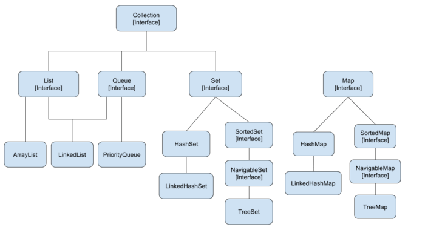

# 1. Java Collections

## 1. Overview

The collections framework is a unified architecture for representing and manipulating collections, enabling them to be manipulated independently of the details of their representation. It reduces programming effort while increasing performance. It enables interoperability among unrelated APIs, reduces effort in designing and learning new APIs, and fosters software reuse. The framework is based on more than a dozen collection interfaces. It includes implementations of these interfaces and algorithms to manipulate them.



Let us see the hierarchy of the Collection framework. The java.util package contains all the classes and interfaces for the Collection framework.

Before going into each topic let’s understand What Is Iterator in java.

## 2. Iterator

Java Iterator is an interface that is practiced in order to iterate over a collection of Java object components entirety one by one. The Java Iterator also helps in the operations like READ and REMOVE.

### 2.1. Java Iterator Methods

The Java Iterator also helps in the operations like READ and REMOVE.

The following figure perfectly displays the class diagram of the Java Iterator interface. It contains a total of four methods that are:

- hasNext()
- next()
- remove()
- forEachRemaining()

```java
// Import the ArrayList class and the Iterator class
import java.util.ArrayList;
import java.util.Iterator;

public class Main {
  public static void main(String[] args) {

    // Make a collection
    ArrayList<String> cars = new ArrayList<String>();
    cars.add("Volvo");
    cars.add("BMW");
    cars.add("Ford");
    cars.add("Mazda");

    // Get the iterator
    Iterator<String> it = cars.iterator();

    // Print the elements in the list
    while(it.hasNext()){
    System.out.println(it.next());
    }
  }
```

## 3. List

List in Java provides the facility to maintain the ordered collection. It contains the index-based methods to insert, update, delete and search the elements. It can have duplicate elements also. We can also store the null elements in the list.

The implementation classes of the List interface are ArrayList, LinkedList, Stack, and Vector. ArrayList and LinkedList are widely used in Java programming. The Vector class is deprecated since Java 5.

### 3.1. ArrayList

Java ArrayList class uses a dynamic array for storing the elements. It is like an array, but there is no size limit. We can add or remove elements anytime. So, it is much more flexible than the traditional array. The ArrayList in Java can have duplicate elements also. It implements the List interface so we can use all the methods of the List interface here. The ArrayList maintains the insertion order internally, and these are non synchronized

Let’s see the example of creating the ArrayList in the java collection.

```java
ArrayList<Integer> list = new ArrayList<Integer>();
```

### 3.2. LinkedList

Java LinkedList class uses a doubly linked list to store the elements. It provides a linked-list data structure. It inherits the AbstractList class and implements List and Deque interfaces.

Java LinkedList class can contain duplicate elements and maintain insertion order. It is non synchronized, and also used as a list, stack, or queue.

Let’s see the example of creating the LinkedList in the java collection.

```java
LinkedList<String> al = new LinkedList<String>();
```

### 3.3. Vector

Vector is like the dynamic array which can grow or shrink its size. Unlike an array, we can store the n-number of elements in it as there is no size limit.

It is recommended to use the Vector class in the thread-safe implementation only. If you don’t need to use the thread-safe implementation, you should use the ArrayList, the ArrayList will perform better in such cases. The Iterators returned by the Vector class are fail-fast. In the case of concurrent modification, it fails and throws the ConcurrentModificationException.

Let’s see the example of creating theVector in the java collection.

```java
Vector<String> vec = new Vector<String>();
```

## 4. Stack

The stack is a linear data structure that is used to store the collection of objects. It is based on Last-In-First-Out (LIFO). Java collection framework provides many interfaces and classes to store the collection of objects. One of them is the Stack class that provides different operations such as push, pop, search, etc.

In Java, Stack is a class that falls under the Collection framework that extends the Vector class. It also implements interfaces List, Collection, Iterable, Cloneable, Serializable. It represents the LIFO stack of objects.

Let’s see the example of creating the Stack in the java collection.

```java
Stack<Integer> stk = new Stack<>();
```

## 5. Queue

Queue interface maintains the first-in-first-out order. It can be defined as an ordered list that is used to hold the elements which are about to be processed. There are various classes like PriorityQueue, Deque, and ArrayDeque which implement the Queue interface.

### 5.1. PriorityQueue

The PriorityQueue class implements the Queue interface. It holds the elements or objects which are to be processed by their priorities. PriorityQueue doesn’t allow null values to be stored in the queue.

Let’s see the example of creating the PriorityQueue in the java collection.

```java
PriorityQueue<String> queue = new PriorityQueue<String>();
```

## 6. Set

A Set is a collection that cannot contain duplicate elements. There are three main implementations of the Set interface: HashSet, TreeSet, and LinkedHashSet. HashSet, which stores its elements in a hash table, is the best-performing implementation; however, it makes no guarantees concerning the order of iteration. TreeSet, which stores its elements in a red-black tree, orders its elements based on their values; it is substantially slower than HashSet. LinkedHashSet, which is implemented as a hash table with a linked list running through it, orders its elements based on the order in which they were inserted into the set (insertion-order).

### 6.1. HashSet

Java HashSet class is used to create a collection that uses a hash table for storage. It inherits the AbstractSet class and implements the Set interface.

The important points about the Java HashSet class are:

- HashSet stores the elements by using a mechanism called hashing.
- HashSet contains unique elements only.
- HashSet allows null value.
- HashSet class is non-synchronized.
- HashSet doesn’t maintain the insertion order. Here, elements are inserted on the basis of their hashcode.
- HashSet is the best approach for search operations. Let’s see the example of creating the HashSet in the java collection.

```java
HashSet<String> set = new HashSet<>();
```

### 6.2. LinkedHashSet

Java LinkedHashSet class is a Hashtable and Linked list implementation of the Set interface. It inherits the HashSet class and implements the Set interface.

LinkedHashSet class contains unique elements only like HashSet. It provides all optional set operations and permits null elements, maintains insertion order, and is also non-synchronized.

Let’s see the example of creating the LinkedHashSet in the java collection.

```java
LinkedHashSet<String> set = new LinkedHashSet();
```

### 6.3. TreeSet

Java TreeSet class implements the Set interface that uses a tree for storage. It inherits AbstractSet class and implements the NavigableSet interface. The objects of the TreeSet class are stored in ascending order.

The important points about the Java TreeSet class are:

- Java TreeSet class contains unique elements only like HashSet.
- Java TreeSet class access and retrieval times are quite fast.
- Java TreeSet class doesn’t allow null elements.
- Java TreeSet class is non-synchronized.
- Java TreeSet class maintains ascending order.

Let’s see the example of creating the TreeHashSet in the java collection.

```java
TreeSet<String> set = new TreeSet<String>();
```

## 7. Map

A map contains values on the basis of key, i.e. key and value pair. Each key and value pair is known as an entry. A Map contains unique keys.

A Map is useful if you have to search, update or delete elements on the basis of a key. There are two interfaces for implementing Map in java: Map and SortedMap, and three classes: HashMap, LinkedHashMap, and TreeMap.

### 7.1. HashMap

Java HashMap class implements the Map interface which allows us to store key and value pairs, where keys should be unique. If you try to insert the duplicate key, it will replace the element of the corresponding key. It is easy to perform operations using the key index like update, delete, etc.

HashMap in Java is like the legacy Hashtable class, but it is not synchronized. It allows us to store the null elements as well, but there should be only one null key.

Let’s see the example of creating the HashMap in the java collection.

```java
HashMap<Integer,String> map = new HashMap<Integer,String>()
```

### 7.2. LinkedHashMap

Java LinkedHashMap class is Hashtable and Linked list implementation of the Map interface, with predictable iteration order. It inherits the HashMap class and implements the Map interface.

ava LinkedHashMap contains values based on the key and unique elements. It may have one null key and multiple null values. It is non-synchronized and maintains insertion order.

Let’s see the example of creating the LinkedHashMap in the java collection.

```java
LinkedHashMap<Integer, String> map = new LinkedHashMap<Integer, String>();
```

### 7.3. TreeMap

Java TreeMap class is a red-black tree based implementation. It provides an efficient means of storing key-value pairs in sorted order.

TreeMap contains values based on the key. It implements the NavigableMap interface and extends AbstractMap class. It contains only unique elements and cannot have a null key but can have multiple null values. It is non-synchronized and maintains ascending order.

Let’s see the example of creating the TreeMap in the java collection.

```java
TreeMap<Integer,String> map = new TreeMap<Integer,String>();
```

# 2. Java Collections Example

## Example(s)

You are given a string `s` and an array of strings `words`. All the strings of `words` are of **the same length.**

A **concatenated substring** in s is a substring that contains all the strings of any permutation of words concatenated.

For example, if `words = ["ab","cd","ef"]`, then `"abcdef"`, `"abefcd"`, `"cdabef"`, `"cdefab"`, `"efabcd"`, and `"efcdab"` are all concatenated strings. `"acdbef"` is not a concatenated substring because it is not the concatenation of any permutation of `words`.

Return the starting indices of all the concatenated substrings in s. You can return the answer **in any order.**

Example 1:

```
Input: s = "barfoothefoobarman", words = ["foo","bar"]
Output: [0,9]
Explanation: Since words.length == 2 and words[i].length == 3, the concatenated substring has to be of length 6.
The substring starting at 0 is "barfoo". It is the concatenation of ["bar","foo"] which is a permutation of words.
The substring starting at 9 is "foobar". It is the concatenation of ["foo","bar"] which is a permutation of words.
The output order does not matter. Returning [9,0] is fine too.
```

Example 2:

```
Input: s = "wordgoodgoodgoodbestword", words = ["word","good","best","word"]
Output: []
Explanation: Since words.length == 4 and words[i].length == 4, the concatenated substring has to be of length 16.
There is no substring of length 16 is s that is equal to the concatenation of any permutation of words.
We return an empty array.
```

Example 3:

```
Input: s = "barfoofoobarthefoobarman", words = ["bar","foo","the"]
Output: [6,9,12]
Explanation: Since words.length == 3 and words[i].length == 3, the concatenated substring has to be of length 9.
The substring starting at 6 is "foobarthe". It is the concatenation of ["foo","bar","the"] which is a permutation of words.
The substring starting at 9 is "barthefoo". It is the concatenation of ["bar","the","foo"] which is a permutation of words.
The substring starting at 12 is "thefoobar". It is the concatenation of ["the","foo","bar"] which is a permutation of words.
```

**Constraints**

1 <= s.length <= 104  
1 <= words.length <= 5000  
1 <= words[i].length <= 30  
s and words[i] consist of lowercase English letters.

```java
public List<Integer> findSubstring(String s, String[] words) {

}
```

```java
class Solution {
    private HashMap<String, Integer> wordCount = new HashMap<String, Integer>();
    private int wordLength;
    private int substringSize;
    private int sizeOfWords;

    private boolean check(int i, String s) {
        // Copy the original dictionary to use for this index
        HashMap<String, Integer> remaining = new HashMap<>(wordCount);
        int wordsUsed = 0;

        // Each iteration will check for a match in words
        for (int j = i; j < i + substringSize; j += wordLength) {
            String sub = s.substring(j, j + wordLength);
            if (remaining.getOrDefault(sub, 0) != 0) {
                remaining.put(sub, remaining.get(sub) - 1);
                wordsUsed++;
            } else {
                break;
            }
        }

        return wordsUsed == sizeOfWords;
    }

    public List<Integer> findSubstring(String s, String[] words) {
        int n = s.length();
        sizeOfWords = words.length;
        wordLength = words[0].length();
        substringSize = wordLength * sizeOfWords;

        for (String word : words) {
            wordCount.put(word, wordCount.getOrDefault(word, 0) + 1);
        }

        List<Integer> answer = new ArrayList<>();
        for (int i = 0; i < n - substringSize + 1; i++) {
            if (check(i, s)) {
                answer.add(i);
            }
        }

        return answer;
    }
}
```
