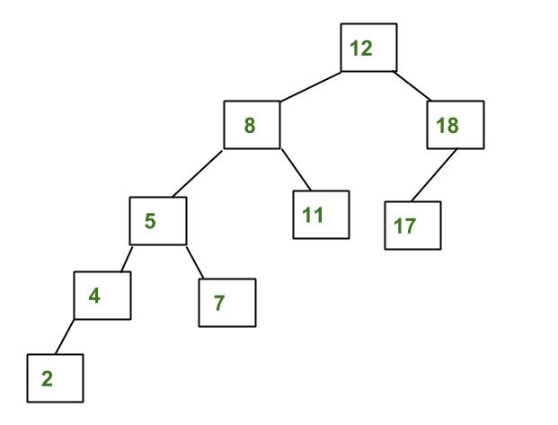
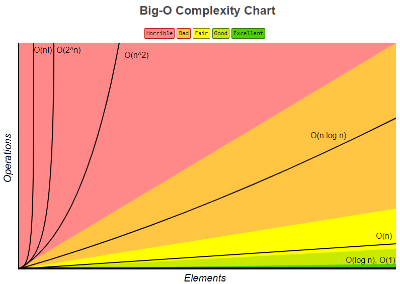
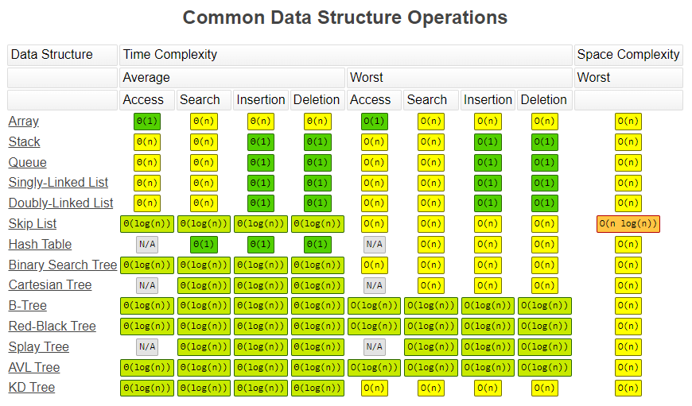
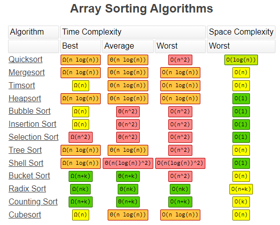

# 1. Searching Algorithms

## 1.1. Sequential Search

Sequential search is a basic form of searching that checks if an element is present in a given list. This method will return a value telling us whether or not the searched value is in the given list.

```java
public class SequentialSearch {

	public static void main(String[] args) {
		int[] exampleVariableOne = { 2, 9, 6, 7, 4, 5, 3, 0, 1 };
		int target = 4;

		sequentialSearch(exampleVariableOne, target);
	}

	public static void sequentialSearch(int[] parameterOne, int parameterTwo) {
		int index = -1;
		// searches each index of the array until it reaches the last index
		for (int i = 0; i < parameterOne.length; i++) {
			if (parameterOne[i] == parameterTwo) {
				// if the target is found, int index is set as the value of i and
				// the for loop is terminated
				index = i;
				break;
			}
		}

		if (index == -1) {
			System.out.println("Your target integer does not exist in the array");
		} else {
			System.out.println("Your target integer is in index " + index + " of the array");
		}
	}
}
```

## 1.2. Binary Search

Sequential search can take an excessively long time since they look through every element in an array. This is like flipping through each page of the dictionary from the beginning even if we are trying to find the word "zero". Let's introduce the concept of binary search, which is similar to flipping right to the 'Z' section of the dictionary to start looking for the word "zero". If an array or ArrayList is ordered, the binary search method can be used. Look below and review the functionality of a binary search:

```java
public class BinarySearch {

	public static void main(String[] args) {
		// the array has to be sorted before binary search
		int[] exampleVariableOne = { 1, 11, 24, 34, 67, 89, 102 };
		int target = 102;

		binarySearch(exampleVariableOne, target);
	}

	public static void binarySearch(int[] parameterOne, int parameterTwo) {
		int index = -1;
		int lowEnd = 0;
		int highEnd = parameterOne.length - 1;

		while (highEnd >= lowEnd) { // Difference of highEnd and lowEnd decreases as the search range narrows
			int middle = (lowEnd + highEnd) / 2;
			// checks if the middle of the lowEnd and the highEnd is the target
			if (parameterOne[middle] == parameterTwo) {
				index = middle; // the target is found
				break;
			} else if (parameterOne[middle] < parameterTwo) {
				// changes the lowEnd to narrow the search range
				lowEnd = middle + 1;
			} else if (parameterOne[middle] > parameterTwo) {
				// changes the highEnd to narrow the search range
				highEnd = middle - 1;
			}
		}

		if (index == -1) {
			System.out.println("Your target integer does not exist in the array");
		} else {
			System.out.println("Your target integer is in index " + index + " of the array");
		}
	}
}
```

## 1.3. Binary Search Tree (BST)

A binary Search Tree is a node-based binary tree data structure which has the following properties:

- The left subtree of a node contains only nodes with keys lesser than the node’s key.
- The right subtree of a node contains only nodes with keys greater than the node’s key.
- The left and right subtree each must also be a binary search tree. There must be no duplicate nodes.

```java
public class BinarySearchTree {

	/*
	 * Class containing left and right child of current node and key value
	 */
	class Node {
		int key;
		Node left, right;

		public Node(int item) {
			key = item;
			left = right = null;
		}
	}

	// Root of BST
	Node root;

	// Constructor
	BinarySearchTree() {
		root = null;
	}

	BinarySearchTree(int value) {
		root = new Node(value);
	}

	// This method mainly calls insertRec()
	void insert(int key) {
		root = insertRec(root, key);
	}

	/*
	 * A recursive function to insert a new key in BST
	 */
	Node insertRec(Node root, int key) {

		/*
		 * If the tree is empty, return a new node
		 */
		if (root == null) {
			root = new Node(key);
			return root;
		}

		/* Otherwise, recur down the tree */
		else if (key < root.key)
			root.left = insertRec(root.left, key);
		else if (key > root.key)
			root.right = insertRec(root.right, key);

		/* return the (unchanged) node pointer */
		return root;
	}

	// This method mainly calls InorderRec()
	void inorder() {
		inorderRec(root);
	}

	// A utility function to
	// do inorder traversal of BST
	void inorderRec(Node root) {
		if (root != null) {
			inorderRec(root.left);
			System.out.println(root.key);
			inorderRec(root.right);
		}
	}

	// Driver Code
	public static void main(String[] args) {
		BinarySearchTree tree = new BinarySearchTree();

		/*
		 * Let us create following BST 50 / \ 30 70 / \ / \ 20 40 60 80
		 */
		tree.insert(50);
		tree.insert(30);
		tree.insert(20);
		tree.insert(40);
		tree.insert(70);
		tree.insert(60);
		tree.insert(80);

		// print inorder traversal of the BST
		tree.inorder();
	}
}
```

## 1.4. AVL Tree

AVL tree is a self-balancing Binary Search Tree (BST) where the difference between heights of left and right subtrees cannot be more than one for all nodes.

### 1.4.1. Example of AVL Tree


The above tree is AVL because the differences between heights of left and right subtrees for every node are less than or equal to 1.

### 1.4.2. Example of a Tree that is NOT an AVL Tree



The above tree is not AVL because the differences between the heights of the left and right subtrees for 8 and 12 are greater than 1.

```java
class Node {
	int key, height;
	Node left, right;

	Node(int d) {
		key = d;
		height = 1;
	}
}

class AVLTree {

	Node root;

	// A utility function to get the height of the tree
	int height(Node N) {
		if (N == null)
			return 0;

		return N.height;
	}

	// A utility function to get maximum of two integers
	int max(int a, int b) {
		return (a > b) ? a : b;
	}

	// A utility function to right rotate subtree rooted with y
	// See the diagram given above.
	Node rightRotate(Node y) {
		Node x = y.left;
		Node T2 = x.right;

		// Perform rotation
		x.right = y;
		y.left = T2;

		// Update heights
		y.height = max(height(y.left), height(y.right)) + 1;
		x.height = max(height(x.left), height(x.right)) + 1;

		// Return new root
		return x;
	}

	// A utility function to left rotate subtree rooted with x
	// See the diagram given above.
	Node leftRotate(Node x) {
		Node y = x.right;
		Node T2 = y.left;

		// Perform rotation
		y.left = x;
		x.right = T2;

		// Update heights
		x.height = max(height(x.left), height(x.right)) + 1;
		y.height = max(height(y.left), height(y.right)) + 1;

		// Return new root
		return y;
	}

	// Get Balance factor of node N
	int getBalance(Node N) {
		if (N == null)
			return 0;

		return height(N.left) - height(N.right);
	}

	Node insert(Node node, int key) {

		/* 1. Perform the normal BST insertion */
		if (node == null)
			return (new Node(key));

		if (key < node.key)
			node.left = insert(node.left, key);
		else if (key > node.key)
			node.right = insert(node.right, key);
		else // Duplicate keys not allowed
			return node;

		/* 2. Update height of this ancestor node */
		node.height = 1 + max(height(node.left), height(node.right));

		/*
		 * 3. Get the balance factor of this ancestor node to check whether this node
		 * became unbalanced
		 */
		int balance = getBalance(node);

		// If this node becomes unbalanced, then there
		// are 4 cases Left Left Case
		if (balance > 1 && key < node.left.key)
			return rightRotate(node);

		// Right Right Case
		if (balance < -1 && key > node.right.key)
			return leftRotate(node);

		// Left Right Case
		if (balance > 1 && key > node.left.key) {
			node.left = leftRotate(node.left);
			return rightRotate(node);
		}

		// Right Left Case
		if (balance < -1 && key < node.right.key) {
			node.right = rightRotate(node.right);
			return leftRotate(node);
		}

		/* return the (unchanged) node pointer */
		return node;
	}

	// A utility function to print preorder traversal
	// of the tree.
	// The function also prints height of every node
	void preOrder(Node node) {
		if (node != null) {
			System.out.print(node.key + " ");
			preOrder(node.left);
			preOrder(node.right);
		}
	}

	public static void main(String[] args) {
		AVLTree tree = new AVLTree();

		/* Constructing tree given in the above figure */
		tree.root = tree.insert(tree.root, 10);
		tree.root = tree.insert(tree.root, 20);
		tree.root = tree.insert(tree.root, 30);
		tree.root = tree.insert(tree.root, 40);
		tree.root = tree.insert(tree.root, 50);
		tree.root = tree.insert(tree.root, 25);

		/*
		 * The constructed AVL Tree would be 30 / \ 20 40 / \ \ 10 25 50
		 */
		System.out.println("Preorder traversal" + " of constructed tree is : ");
		tree.preOrder(tree.root);
	}
}
```

# 2. Big O

Big O notation is the language we use for talking about how long an algorithm takes to run. It's how we compare the efficiency of different approaches to a problem.

It's like math except it's an awesome, not-boring kind of math where you get to wave your hands through the details and just focus on what's basically happening.

With big O notation we express the runtime in terms of—brace yourself—how quickly it grows relative to the input, as the input gets arbitrarily large.

Let's break that down:

1. **How quickly the runtime grows** — It's hard to pin down the exact runtime of an algorithm. It depends on the speed of the processor, what else the computer is running, etc. So instead of talking about the runtime directly, we use big O notation to talk about how quickly the runtime grows.

2. **Relative to the input** — If we were measuring our runtime directly, we could express our speed in seconds. Since we're measuring how quickly our runtime grows, we need to express our speed in terms of...something else. With Big O notation, we use the size of the input, which we call "n". So we can say things like the runtime grows "on the order of the size of the input" (O(n)) or "on the order of the square of the size of the input" (O(n^2)).

3. **As the input gets arbitrarily large** — Our algorithm may have steps that seem expensive when n is small but are eclipsed eventually by other steps as n gets huge. For big O analysis, we care most about the stuff that grows fastest as the input grows, because everything else is quickly eclipsed as n gets very large. (If you know what an asymptote is, you might see why "big O analysis" is sometimes called "asymptotic analysis.")

If this seems abstract so far, that's because it is. Let's look at some examples.

## 2.1. Some Examples

```java
public static void printFirstItem(int[] items) {
    System.out.println(items[0]);
}
```

**This method runs in O(1) time (or "constant time") relative to its input.** The input array could be 1 item or 1,000 items, but this method would still just require one "step."

```java
public static void printAllItems(int[] items) {
    for (int item : items) {
        System.out.println(item);
    }
}
```

**This method runs in O(n) time (or "linear time"), where n is the number of items in the array.** If the array has 10 items, we have to print 10 times. If it has 1,000 items, we have to print 1,000 times.

```java
public static void printAllPossibleOrderedPairs(int[] items) {
    for (int firstItem : items) {
        for (int secondItem : items) {
            System.out.println(firstItem + ", " + secondItem);
        }
    }
}
```

Here we're nesting two loops. If our array has n items, our outer loop runs n times and our inner loop runs n times for each iteration of the outer loop, giving us n^2 total prints. Thus, **this method runs in O(n^2) time (or "quadratic time")**. If the array has 10 items, we have to print 100 times. If it has 1,000 items, we have to print 1,000,000 times.

## 2.2. N could be the actual input, or the size of the input

Both of these methods have O(n) runtime, even though one takes an integer as its input and the other takes an array:

```java
public static void sayHiNTimes(int n) {
    for (int i = 0; i < n; i++) {
        System.out.println("hi");
    }
}

public static void printAllItems(int[] items) {
    for (int item : items) {
        System.out.println(item);
    }
}
```

So sometimes nn is an actual number that's an input to our method, and other times nn is the number of items in an input array (or an input map, or an input object, etc.).

## 2.3. Drop the constants

This is why big O notation rules. When you're calculating the big O complexity of something, you just throw out the constants. So like:

```java
public static void printAllItemsTwice(int[] items) {
    for (int item : items) {
        System.out.println(item);
    }

    // once more, with feeling
    for (int item : items) {
        System.out.println(item);
    }
}
```

This is O(2n), which we just call O(n).

```java
public static void printFirstItemThenFirstHalfThenSayHi100Times(int[] items) {
    System.out.println(items[0]);

    int middleIndex = items.length / 2;
    int index = 0;

    while (index < middleIndex) {
        System.out.println(items[index]);
        index++;
    }

    for (int i = 0; i < 100; i++) {
        System.out.println("hi");
    }
}
```

This is O(1 + n/2 + 100), which we just call O(n).

Why can we get away with this? Remember, for big O notation we're looking at what happens as nn gets arbitrarily large. As nn gets really big, adding 100 or dividing by 2 has a decreasingly significant effect.

## 2.4. Drop the less significant terms

For example:

```java
public static void printAllNumbersThenAllPairSums(int[] numbers) {

    System.out.println("these are the numbers:");
    for (int number : numbers) {
        System.out.println(number);
    }

    System.out.println("and these are their sums:");
    for (int firstNumber : numbers) {
        for (int secondNumber : numbers) {
            System.out.println(firstNumber + secondNumber);
        }
    }
}
```

Here our runtime is O(n + n^2), which we just call O(n^2). Even if it was O(n^2/2 + 100n), it would still be O(n^2).

Similarly:

- O(n^3 + 50n^2 + 10000) is O(n^3)
- O((n + 30) \* (n + 5)) is O(n^2)

Again, we can get away with this because the less significant terms quickly become, well, less significant as n gets big.

## 2.5. We're usually talking about the "worst case"

Often this "worst case" stipulation is implied. But sometimes you can impress your interviewer by saying it explicitly.

Sometimes the worst case runtime is significantly worse than the best case runtime:

```java
public static boolean contains(int[] haystack, int needle) {

    // does the haystack contain the needle?
    for (int n : haystack) {
        if (n == needle) {
            return true;
        }
    }

    return false;
}
```

Here we might have 100 items in our haystack, but the first item might be the needle, in which case we would return in just 1 iteration of our loop.

In general we'd say this is O(n) runtime and the "worst case" part would be implied. But to be more specific we could say this is worst case O(n) and best case O(1) runtime. For some algorithms we can also make rigorous statements about the "average case" runtime

## 2.6. Space complexity: The final frontier

Sometimes we want to optimize for using less memory instead of (or in addition to) using less time. Talking about memory cost (or "space complexity") is very similar to talking about time cost. We simply look at the total size (relative to the size of the input) of any new variables we're allocating.

This method takes O(1) space (we use a fixed number of variables):

```java
public static void sayHiNTimes(int n) {
    for (int i = 0; i < n; i++) {
        System.out.println("hi");
    }
}
```

This method takes O(n) space (the size of hiArray scales with the size of the input):

```java
public static String[] arrayOfHiNTimes(int n) {
    String[] hiArray = new String[n];
    for (int i = 0; i < n; i++) {
        hiArray[i] = "hi";
    }
    return hiArray;
}
```

Usually when we talk about space complexity, we're talking about additional space, so we don't include space taken up by the inputs. For example, this method takes constant space even though the input has nn items:

```java
public static int getLargestItem(int[] items) {
    int largest = Integer.MIN_VALUE;
    for (int item : items) {
        if (item > largest) {
            largest = item;
        }
    }
    return largest;
}
```

Sometimes there's a tradeoff between saving time and saving space, so you have to decide which one you're optimizing for.

## 2.7. Big O analysis is awesome except when it's not

You should make a habit of thinking about the time and space complexity of algorithms as you design them. Before long this'll become second nature, allowing you to see optimizations and potential performance issues right away.

Asymptotic analysis is a powerful tool, but wield it wisely.

Big O ignores constants, but sometimes the constants matter. If we have a script that takes 5 hours to run, an optimization that divides the runtime by 5 might not affect big O, but it still saves you 4 hours of waiting.

Beware of premature optimization. Sometimes optimizing time or space negatively impacts readability or coding time. For a young startup it might be more important to write code that's easy to ship quickly or easy to understand later, even if this means it's less time and space efficient than it could be.

But that doesn't mean startups don't care about big O analysis. A great engineer (startup or otherwise) knows how to strike the right balance between runtime, space, implementation time, maintainability, and readability.

**You should develop the skill to see time and space optimizations, as well as the wisdom to judge if those optimizations are worthwhile.**

## 2.8. Common Algorithms Complexity

  
  

