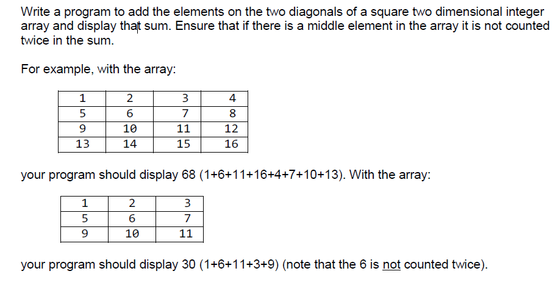

# Multi-dimensional Array

## 1. Definition

**A Multi-dimension array is an array of arrays**.

A `int` single-dimension array, e.g.: `int[] nums`, is an array of `int`, each element is an integer.

A `int` 2-d array, e.g.: `int[][] numss`, is an array of `int[]`, each element is an integer array.

For naming an array, we can

1. add `s` after the noun for 1-d array, e.g.: `clocks`, and `ss` after the noun for 2-d array, e.g.: `clockss`.
2. add `Array` after the noun for 1-d array, e.g.: `personArray`, and `2Array` or `2dArray` after the noun for 2-d array, e.g.: `person2dArray`.

## 2. Initialization

1. Use the keyword `new` to initialize a 2-d array

```java
// initialize a 2-d array with 1 size
// the first [] indicates the row, the second [] indicates the column
// [3][]: 3 rows, the column is not fixed

int[][] numss = new int[3][];			// most general way to initialize a 2-d array {null, null, null}
int[][][] numsss = new int[4][][];		// {null, null, null, null}

// initialize a 2-d array with 2 sizes
// [2][3]: 2 rows, 3 columns
int[][] numss2 = new int[2][3];				// {{0, 0, 0}, {0, 0, 0}}
int[][][] numsss = new int[2][3][4];		// {{{ 0, 0, 0, 0}, { 0, 0, 0, 0}, { 0, 0, 0, 0}}, {{ 0, 0, 0, 0}, { 0, 0, 0, 0}, { 0, 0, 0, 0}}}

```

2. Use `{}` to initialize a 2-d array

```java
// each element inside of a 2-d array is an 1-d array
int[][] numss = {null, {}, {1, 2, 3}, nums, new int[]{1, 2, 3}};
int[][][] numsss = {null, {{}}, {null}, {{1, 2, 3}, {1, 2}}, new int[1][2]};

// Error: cannot convert double[] to int[]
int[][] numss6 = { new double[]{5.5, 2.2} };
```

In general, if you know the data have some specific values, use the second way, else use the first way, then check if the data should be stored in a matrix, then put two sizes there, else just give the first size.

## 2 Index system

For 2-d array, since there are two sizes (row and column), if you indicate one single index (should be in the first []), you will get a single-dimension array; if you indicate two indexes, you can get a real value from the array

```java
// 1 2 3
// 4 5
// 7 8 9 0
int[][] numss = {{1, 2, 3}, {4, 5}, {7, 8, 9, 0}};
// numss[row][col]
// numss[1]   ->   a 1-d array: {4, 5}
// numss[1][0]  -> a real value: 4
```

Your index may get out of bound on both the row-level or the column-level.

```java
int[][] numss = {{1, 2, 3}, {4, 5}, {7, 8, 9, 0}};
// numss[3] -> out of bound
// numss[3][0] -> out of bound
// numss[0][3] -> out of bound
```

## 3. for loop

### 3.1 regular-for

To use regular-for loop, you need to first find the size of the array:

1. to check the number of rows of a 2-d array, use `numss.length`
2. to check the number of columns of a matrix-like 2-d array , use `numss[0].length`
3. to check the number of columns of a non-matrix-like 2-d array , use `numss[i].length`

```java
// 1 2 3
// 4 5 6
int[][] numss = {{1, 2, 3}, {4, 5, 6}};

for (int i = 0; i < numss.length; i++)			// row level
    for (int j = 0; j < numss[i].length; j++) {	// column level
        System.out.print(numss[i][j]);			// read an element
        numss[i][j]++;				// modify an element
    }

```

### 3.2 enhanced for

```java
/**
 * Calculates the sum of a 2d array
 * @param numss the input 2d array
 * @return the sum of the 2d array
 */
public static double sum(double[][] numss) {
    int sum = 0;

    for (double[] nums : numss)
        for (double num : nums)
            sum += num;

    return sum;
}

```

### 3.3 mix of the two

It is common to see a mix of the regular-for and enhanced-for in multi-dimension arrays

```java
/**
 * Increases each element in the array by a specific value
 * @param numss the input array
 * @param value the amount to increase
 */
public static void increaseValue(double[][] numss, double value) {
    for (double[] nums : numss)						// enhanced-for, nothing to change on 2d-array-level
        for (int j = 0; j < nums.length; j++)		// regular-for, value changes on 1d-array-level
            nums[j] += value;
}
```

## 4 Arrays class methods

1. `Arrays.deepToString()` for multi-dimension (not necessary only 2d) array
2. `Arrays.deepEquals()` for multi-dimension array

## 5 Some Examples



```java
/**
 *
 * @author adinashby
 */
public class Week3Part1MultiExample {
    public static void main(String[] args) {

        int[][] theArray = {
            {1, 2, 3, 4},
            {5, 6, 7, 8},
            {9, 10, 11, 12},
            {13, 14, 15, 16}
        };

        int sumOfPrimaryDiagonal = 0;
        int sumOfSecondaryDiagonal = 0;

        for(int row = 0; row < theArray.length; row++) {
            sumOfPrimaryDiagonal += theArray[row][row];
            sumOfSecondaryDiagonal += theArray[row][theArray.length - 1 - row];
        }

        System.out.println(sumOfPrimaryDiagonal);
        System.out.println(sumOfSecondaryDiagonal);

        int sum = sumOfPrimaryDiagonal + sumOfSecondaryDiagonal;

        if (theArray.length % 2 != 0)
            sum -= theArray[theArray.length/2][theArray.length/2];
            System.out.println("total sum:" + sum);
    }
}
```

---
